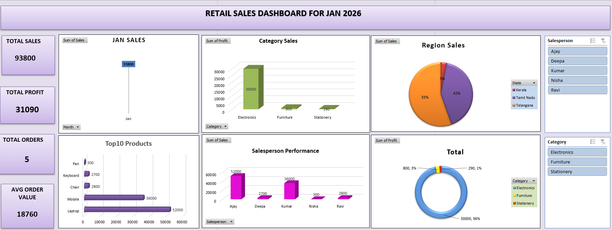

# Retail Sales Dashboard (January 2026)

## 📌 Project Overview
An interactive retail sales dashboard designed to analyze operational performance, profitability, regional distribution, and individual sales contributor metrics for January 2026.

---

## 🛠️ Tools Used
* **Microsoft Excel**: Data cleaning, Pivot Tables, Pivot Charts, and interactive Slicers.

---

## 📊 Key Performance Indicators (KPIs)
* **Total Sales:** 93,800
* **Total Profit:** 31,090
* **Total Orders:** 5
* **Average Order Value (AOV):** 18,760

---

## 📈 Visual Breakdowns & Insights

* **Category Sales & Profit:**
  * **Electronics** is the core profit engine, contributing **30,000 (96%)** of total profit.
  * **Furniture** contributed **800 (3%)** and **Stationery** contributed **290 (1%)**.

* **Regional Distribution (State Level):**
  * **Telangana:** 55% of sales volume.
  * **Tamil Nadu:** 42% of sales volume.
  * **Kerala:** 3% of sales volume.

* **Top Products:**
  * **Laptop:** 52,000 (highest-grossing product).
  * **Mobile:** 36,000.
  * **Chair (2,800)**, **Keyboard (2,700)**, and **Pen (300)** represent lower-ticket accessories.

* **Salesperson Performance:**
  * **Ajay:** Top performer with **52,000** in sales.
  * **Kumar:** Second-highest contributor at **36,000**.
  * **Ravi (2,800)**, **Deepa (2,700)**, and **Nisha (300)** round out the team volume.

---

## ⚙️ Interactive Controls
Equipped with dynamic Excel slicers to filter all dashboard visuals on the fly:
* **Salesperson Slicer:** Ajay, Deepa, Kumar, Nisha, Ravi
* **Category Slicer:** Electronics, Furniture, Stationery

## 📌 Project Overview
An interactive retail sales dashboard designed to analyze operational performance, profitability, regional distribution, and individual sales contributor metrics for January 2026.

## 📊 Dashboard Preview

